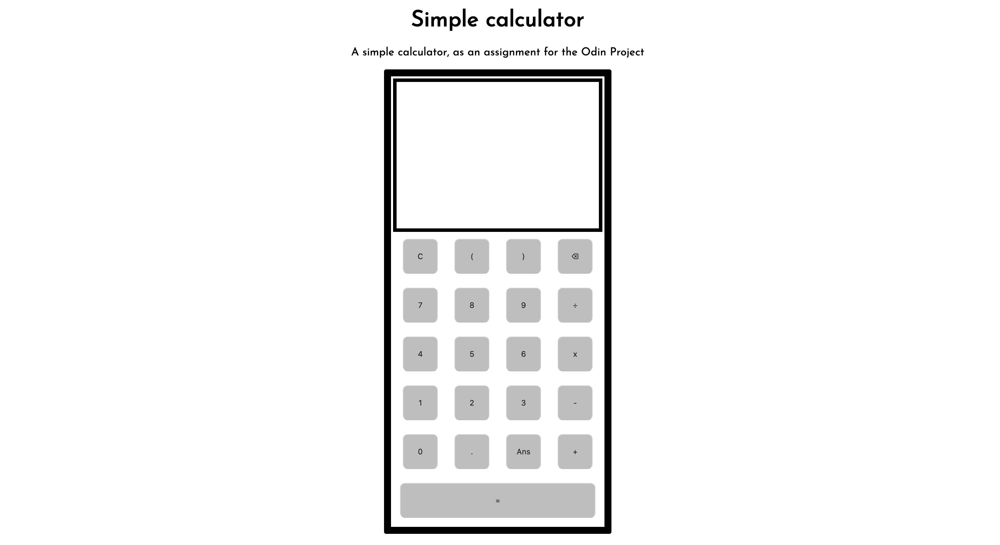

# calculator

An online calculator, created with HTML, CSS and Javascript as part of the Odin Project.

For anyone interested, click [here](https://c-likethis123.github.io/calculator/) to check it out.

# Reflections

Through this project, I learnt how to create a simple calculator. My biggest challenge was in implementing the shunting yard algorithm in my calculator to evaluate expressions.

# Future improvements

I could add keyboard support, which would greatly improve the user experience of using this calculator.